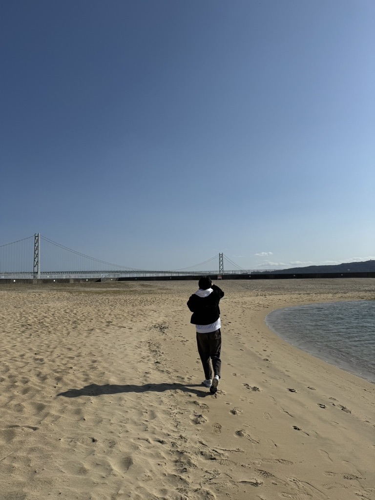
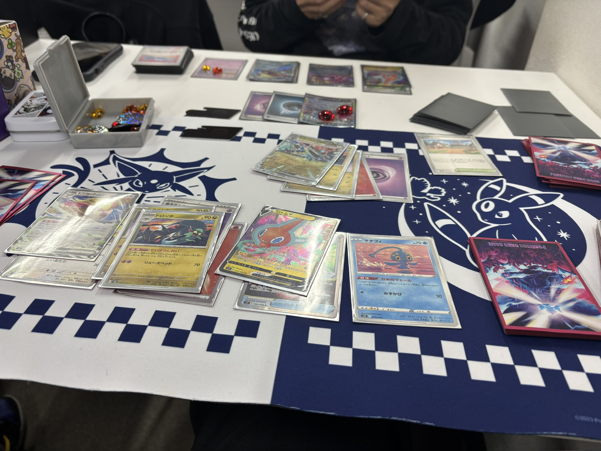

# tomoyaigari
<header>
  <h1>私のポートフォリオ</h1>
  <nav>
    <ul>
      <li><a href="#about">自己紹介</a></li>
      <li><a href="#works">趣味</a></li>
      
    </ul>
  </nav>
</header>
<section id="about">
  <h2>自己紹介</h2>
  

    こんにちは！私は大学生の猪狩知哉です。私は早稲田大学人間科学部に所属しており、プログラミングなどについて日々学んでいます。
今回は私の趣味について書きたいと思います。

  

  
</section>
<section id="works">
  <h2>趣味</h2>
  

    <h3>サッカー</h3>
    
    

      <strong>先日見に行った高校サッカー選手権での写真</strong> 
      私はサッカーを小学生から高校生まで取り組んでいました。今でもよく観戦に行きます。いつかは海外に行ってプロの試合を見てみたいと考えています。
    

    
  

  

    <h3>ポケモンカード</h3>
    
    

      こちらも小学生の頃からやっており今でも友達と定期的に集まって対戦会をしています。
    

    
  

</section>
<section id="skills">
  <h2></h2>
  <ul>
    
  </ul>
</section>
